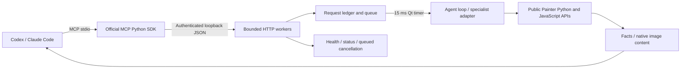

# Architecture and guarantees

Painter MCP has a small stdio MCP process and a standard Python plugin running
inside Painter. Adobe's Python integration already owns Qt; there is no C++
extension, embedded second interpreter, unofficial RPC dependency or DLL injection.

## Execution and lifecycle

`plugin.start_plugin` runs on Painter's application thread. It registers public
Adobe events, creates a Qt `QObject` and `QTimer` on that thread, then starts the
loopback listener. The timer advances one ungrouped workflow step per tick.
The adapter asserts its application-thread identity. HTTP workers never invoke
Adobe APIs. This follows Qt's documented
[thread-affinity rules](https://doc.qt.io/qtforpython-6/overviews/qtcore-timers.html).

Painter's public `project.is_busy()` gates application work. The design uses its
own bounded queue rather than retaining callbacks in `execute_when_not_busy`,
whose lifecycle is owned by Painter. This keeps every accepted request accounted
for across project close and plugin shutdown. It does not pump a nested Qt event
loop or call private `_substance_painter` APIs.

Project create/open and mesh reload can schedule further application work.
Ungrouped batches yield between steps, allowing the event loop to finish that
work. Grouped layerstack batches execute in one callback inside Adobe's public
`ScopedModification`; they yield only after that scope has closed.

Ordinary health and request-status calls bypass the application queue. Baking
job queries and cancellation still execute on the application thread, but may
bypass busy gating between yielded workflow steps. An executing native operation
can occupy the UI thread; an extension holding the Python GIL can also delay HTTP
workers. Responsiveness is not a guarantee of preemption.

Shutdown stops the timer, refuses new work, marks queued requests failed without
side effects, records interrupted yielded work as potentially partial, closes the
listener, removes event and application-exit callbacks, invalidates object/session
state, and deletes only its own connection file. A second live instance cannot
overwrite another instance's discovery file. Give multiple Painter instances
different `PAINTER_MCP_CONNECTION` files.

## Recovery ledger

Every accepted request has an ID. For deliberate retries, use
`<runtime_id>:<logical-action-id>`. The external client generates an ID before
sending when none is supplied and includes it in uncertain-outcome errors.
The runtime prefix prevents replaying an old action into a restarted plugin.

The fingerprint includes tool name and arguments, excluding request ID and wait
duration. Identical submissions reuse the existing record. Changed arguments
with an existing ID are rejected before enqueue. States are `queued`, `running`,
`completed` and `failed`. Cancelling queued work produces a failed terminal result
with `CANCELLED_BEFORE_START`. Running code is not force-cancellable.

Results expire after 15 minutes or when the 32 MB result budget is exhausted.
ID fingerprints remain as tombstones until plugin shutdown; an expired result
never enables the action to execute again. At 4,096 retained IDs, new work is
refused. Finish/recover outstanding work before restarting the plugin. The queue
holds at most 64 waiting requests. Recovery is memory-only: process crashes lose
it. There is no claim of exactly-once execution across application restarts.

The MCP client can restart without losing plugin recovery state. Persistent Python
sessions and request IDs are shared by trusted clients possessing the local
connection credential. They are not tenant isolation. Closing a Python namespace
or an MCP stdio process does not cancel queued application work.

## Identity and scoped state

References contain a random project epoch and native node, stack or texture-set
identity. Nodes resolve through public `get_node_by_uid`; texture sets/stacks
resolve against the current project. Renames preserve identity. Project
create/open/close and mesh reload invalidate references and Python sessions.
References are not durable across reloads or guaranteed against undocumented
native UID reuse in history operations. Generic object handles are retained in
a 512-entry LRU and fail explicitly after eviction.

Observations store a hash of the returned scoped facts for ten minutes, at most
64 observations. A guard rereads those fields at batch start. Change cursors use
the same snapshots: they answer whether covered facts differ, not a history of
every edit. Pixel contents, brush strokes, unreturned layers, resource contents,
shader evaluation, other texture sets and changes that revert are outside this
coverage. Users may edit between yielded steps. There is no document lock.

Query pagination uses frozen JSON snapshots with a two-minute lifetime. Snapshots
are invalidated by project replacement and bounded to 16 queries / 8 MB total.
Each individual query is capped at 4 MB; each page is capped at 200 items and
48 KB. Native resource search itself returns a complete list; narrow queries
avoid expensive application-side enumeration before pagination.

## Results, failures and undo

Structured facts are capped at 64 KiB and mirrored in a text content block for
MCP compatibility. Images occupy native `ImageContent`, never a base64 field in
facts. Each encoded image is capped at 2 MB; a script may emit one SDK image plus
one post-observation image. Text truncation preserves execution/step states and
undo/error summaries. Larger intermediates belong in selected outputs, page
queries or the SDK's explicit result store.

Workflows stop after a failure and report completed, failed and skipped steps.
Native APIs can edit before raising. Output-selection errors retain the step's
completed state; failed post-observation never repeats or rolls back edits.
`undo:"layerstack"` rejects non-layerstack mutations before starting. Individual
operations retain Painter's normal undo behavior; file writes and baking are not
covered by a layerstack undo group. No automatic undo/rollback is issued.

## Relationship to Maya-MCP

The local `D:\Maya-MCP` reference informed compact schema discovery, combined
observation, earlier-result references, output selection, persistent SDK sessions,
explicit recovery states and the companion skill. Painter's implementation is
independent. It does not reuse Maya's DAG callbacks, MEL, VP2 capture, C++ dispatcher,
undo assumptions or exact API-version binary packaging. Scoped snapshot comparison
and Qt scheduling reflect Painter's actual public execution model.

## Code map

| File | Responsibility |
|---|---|
| `catalog.py` | Eight MCP tools and on-demand specialist schemas |
| `engine.py` | Validation, batch references, output selection, observation, scripts and SDK |
| `state.py` | Project epochs, snapshots, pagination, object handles and sessions |
| `adapter.py` | Public Adobe API calls and isolated Qt capture fallback |
| `broker.py` | Thread-safe request states, deduplication, queue and recovery retention |
| `transport.py` | Bounded authenticated loopback HTTP workers |
| `plugin.py` | Application-thread startup, timer, events and shutdown |
| `client.py`, `server.py` | Discovery, recovery rendering and official MCP stdio integration |
| `install.py`, `cli.py` | Managed installation, client configuration, repair and diagnostics |
| `updater.py`, `updater_ui.py`, `bootstrap.py` | GitHub release checks, verified side-by-side preparation, stable startup/client selection and rollback |

The updater added in 1.1.0 follows Maya-MCP's daily check and install/later/release
notification flow. Downloads and subprocess preparation run off the app thread;
Qt owns menu actions and notifications. Stable launchers select one active package
for Painter and the stdio client after restart. See [updates](UPDATES.md) for the
manifest trust chain, compatibility rules, user-edit protection and recovery.
